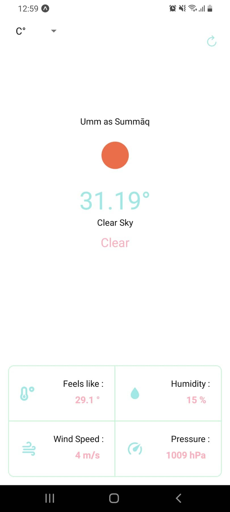

# Simple Weather App

**Made with react native, nodejs**

This app is so simple to use all you have to do is to give permission to the app to use your location and immediately you will be given the weather information in your area, in the middle you can see the temperature, and beneath it you can view some other details. you can also choose the unit for the temperature.

# Over View

### Cloning

if you want to clone the project make sure to follow these steps:

**clone the project:**

    $ git clone https://github.com/yasmeenokh/js-401d9-class-41

navigate to the project directory.

**install required dependencies:**

    $ npm install

you should have expo-cli installed globally to view the application.

**To view the application:**

    $ expo start

Create a tunnel scan the QR code on your phone.
